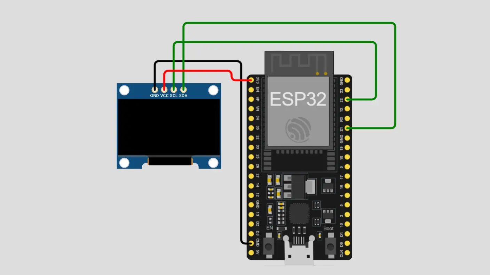

# 🎨 ESP32 OLED Drawing Pad

Create drawings directly on a **128×64 SSD1306 OLED display** using an ESP32. This project demonstrates interactive OLED graphics, real-time drawing, cursor movement, and user input with the ESP32 framework.

---

## ✨ Features

- 🎨 Draw directly on the OLED display
- 🖊️ Real-time pixel-based drawing
- 📺 Smooth cursor movement and graphics rendering
- ⚡ Lightweight and optimized for ESP32
- 🛠️ Simple and easy-to-use drawing interface
- 📚 Beginner-friendly and well-structured code

---

## 🛠️ Hardware Required

| Component | Quantity |
|-----------|:--------:|
| ESP32 Development Board | 1 |
| SSD1306 OLED Display (128×64) | 1 |
| Input Controller | 1 |
| Breadboard | 1 |
| Jumper Wires | As Required |
| USB Cable | 1 |

---

## 🔌 Wiring Diagram

| OLED Pin | ESP32 Pin |
|-----------|-----------|
| VCC | 3.3V |
| GND | GND |
| SDA | GPIO 21 |
| SCL | GPIO 22 |

### Circuit Diagram

  

---

## 💻 Software Requirements

Install the following libraries using the **Arduino IDE Library Manager**:

- Adafruit GFX
- Adafruit SSD1306

---

## 🚀 Getting Started

1. Download or clone this repository.
2. Extract the ZIP file if downloaded.
3. Open the `oled-pad.ino` file from the project folder.
4. Install the required libraries.
5. Select your **ESP32** board.
6. Select the correct **COM Port**.
7. Connect the OLED display and input controller.
8. Click **Upload**.
9. Start drawing on the OLED display.

---

## 💻 Source Code

The complete Arduino sketch is available in:

**`oled-pad.ino`**

---

## 📸 Expected Result

After uploading the code:

- 🎨 The drawing interface appears on the OLED.
- 🖊️ Move the cursor and draw on the display.
- 📺 Drawings are rendered in real time.
- 🔄 The interface remains active for continuous drawing.

---

## ⚙️ Customization

You can personalize the project by modifying:

- Cursor speed
- Drawing controls
- Cursor appearance
- Drawing behavior
- Display graphics
- Input controls

---

## ⚠️ Troubleshooting

| Problem | Solution |
|---------|----------|
| OLED remains blank | Check the wiring and I²C connections |
| Upload failed | Verify the ESP32 board and COM port |
| Cursor not moving | Check the input controller wiring |
| Drawing not visible | Confirm the OLED resolution and library setup |
| Display not detected | Check the OLED I²C address and power connections |

---

## 📚 Technologies Used

- ESP32
- Arduino IDE
- C++
- SSD1306 OLED Display
- I²C Communication
- Adafruit GFX
- Adafruit SSD1306

---

## ⭐ Support

If you found this project helpful, consider giving this repository a **⭐ Star**.

Your support helps **LifeTronix** create more open-source Arduino, ESP32, IoT, and Robotics projects.

---

## 📄 License

This project is licensed under the **MIT License**.

---

Made with ❤️ by <strong>LifeTronix</strong>

